# Hotel admin (staff dashboard + platform console)

The operator side of the hotel management platform built by Devstrike Digital Limited:

- **Hotel admin** for owners, managers and front-desk staff: the live Key Rack, rooms, room types,
  staff, property settings, billing and the audit log.
- **Platform console** (`/platform`) for Devstrike staff: revenue, tenants, plans and add-ons.

The product name is not final. It is read from `NEXT_PUBLIC_APP_NAME` everywhere (wordmark, titles,
copy) and never hard-coded.

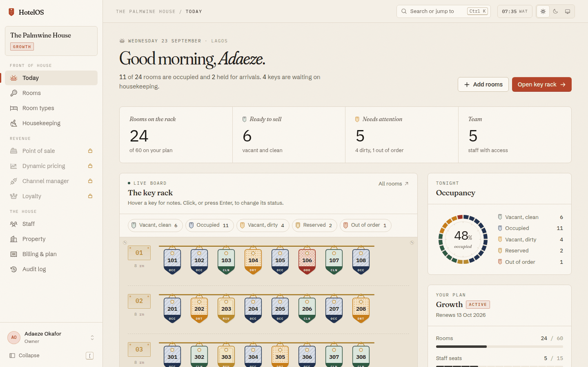

| | |
|---|---|
| 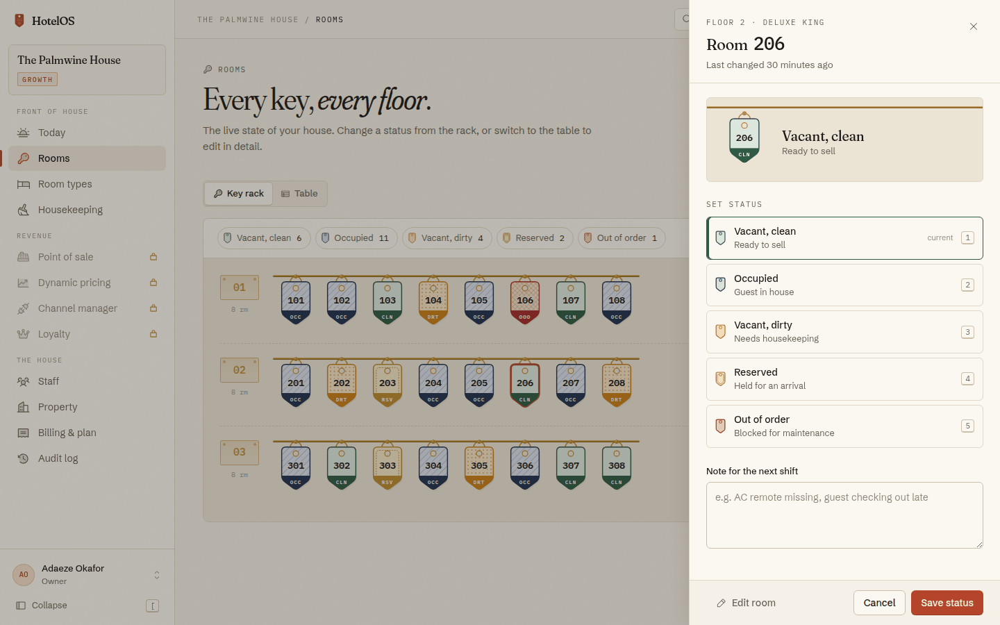 | 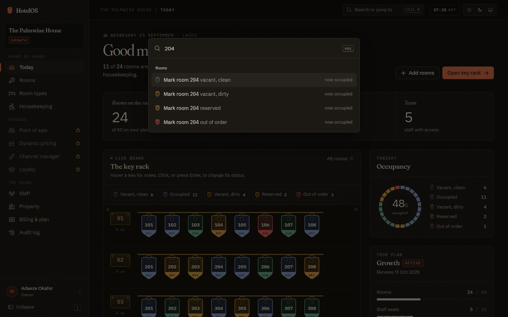 |
| 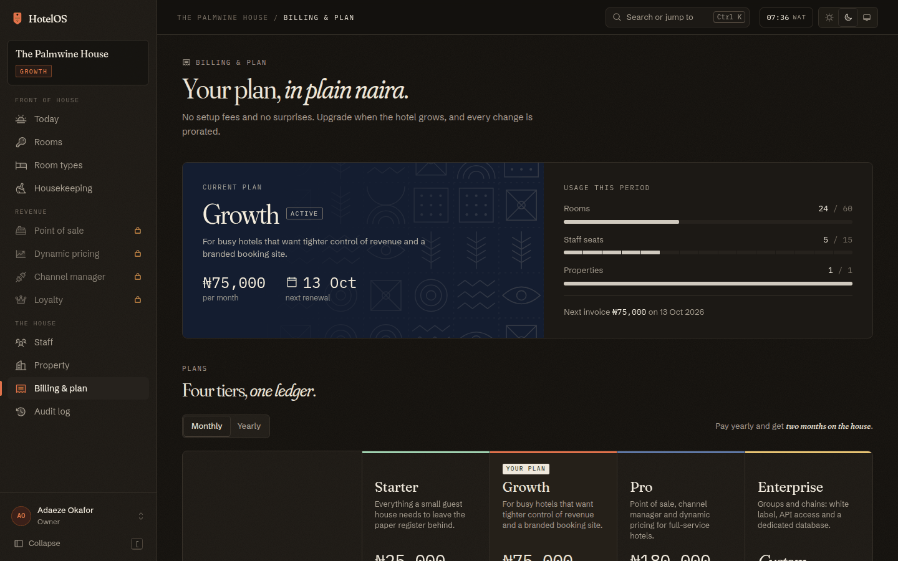 | 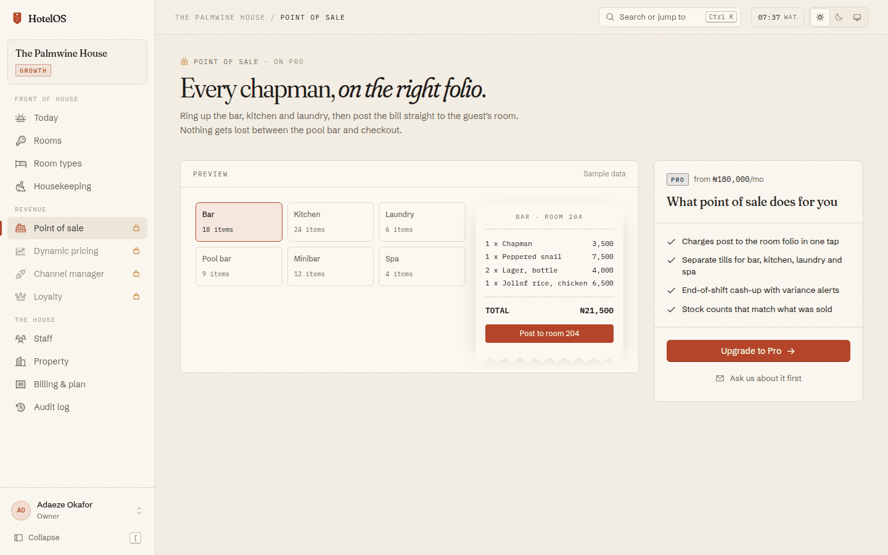 |
| 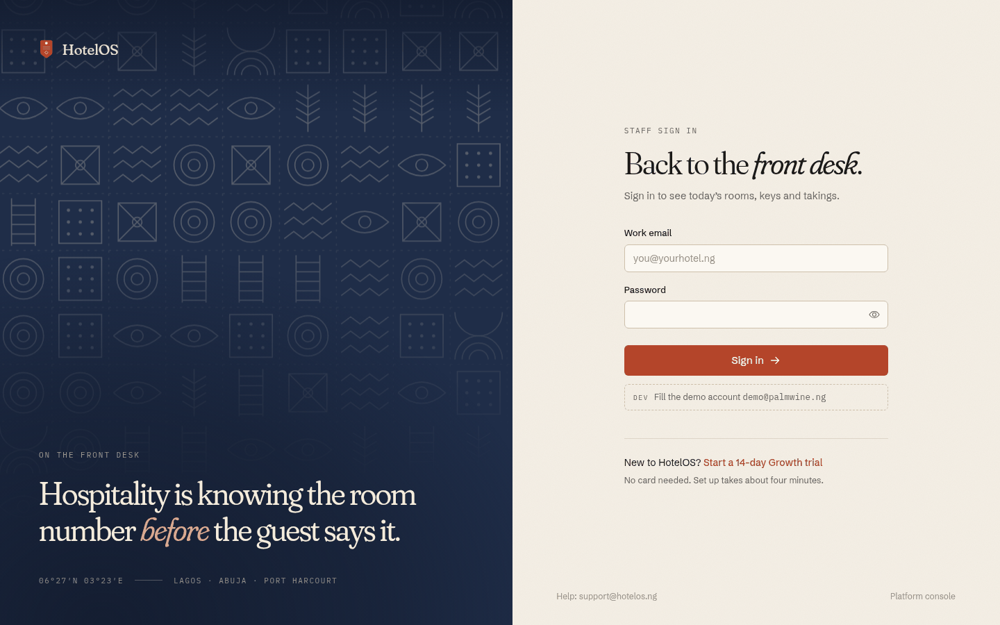 | 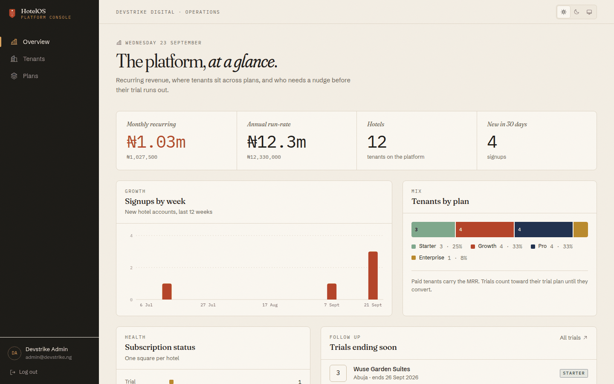 |

On a phone: [Today](docs/screenshots/today-390-light.png), [Rooms, dark](docs/screenshots/rooms-390-dark.png),
[status sheet](docs/screenshots/key-rack-sheet-390-light.png).
All screenshots (1440px and 390px, light and dark) are in [`docs/screenshots`](docs/screenshots).

## Milestone 2: running the front desk

Reservations, the guest register, check-in and check-out, folios with Nigerian taxes, payments inside
cashier shifts, Revenue Guard, reports and an offline front desk. Screenshots were taken against the
live API and its seeded demo hotel.

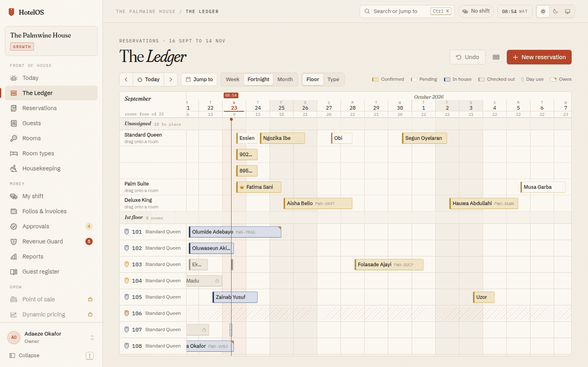

| | |
|---|---|
| 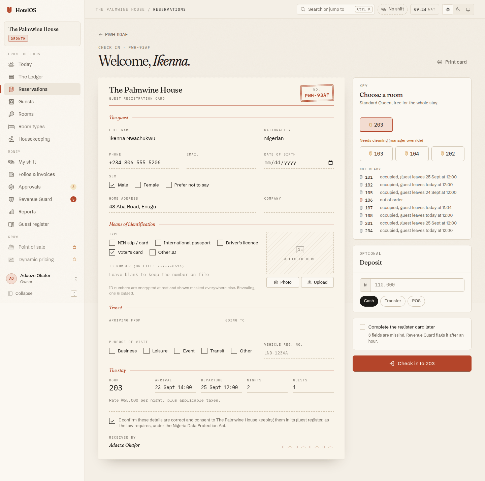 | 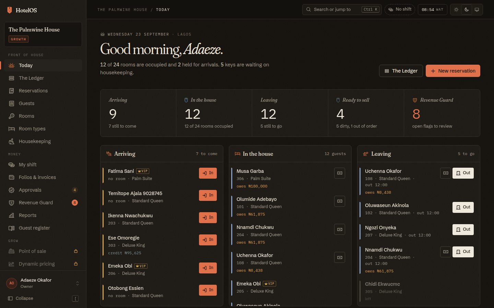 |
| 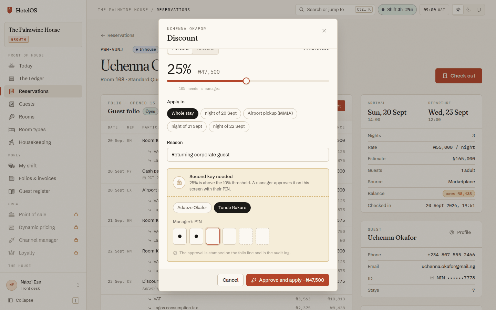 | 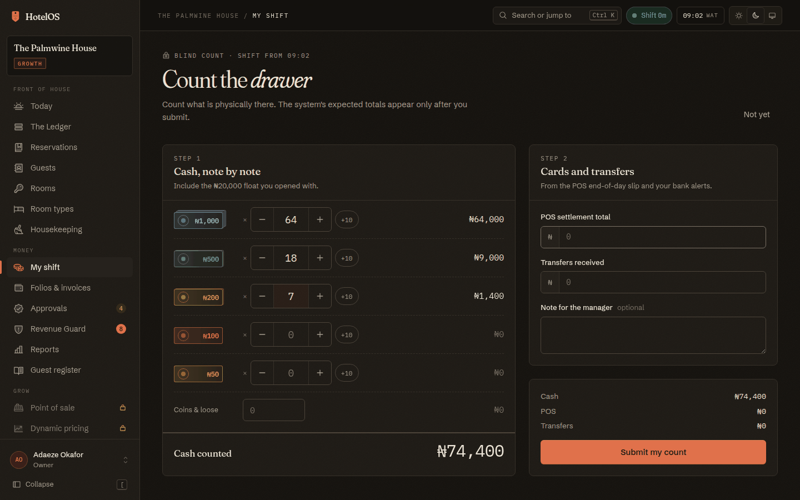 |
| 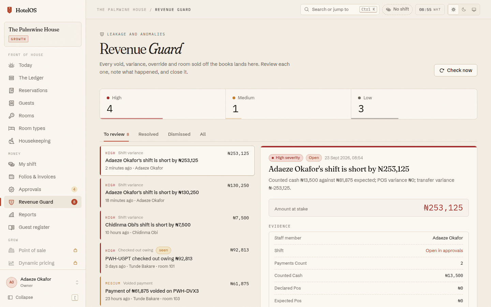 | 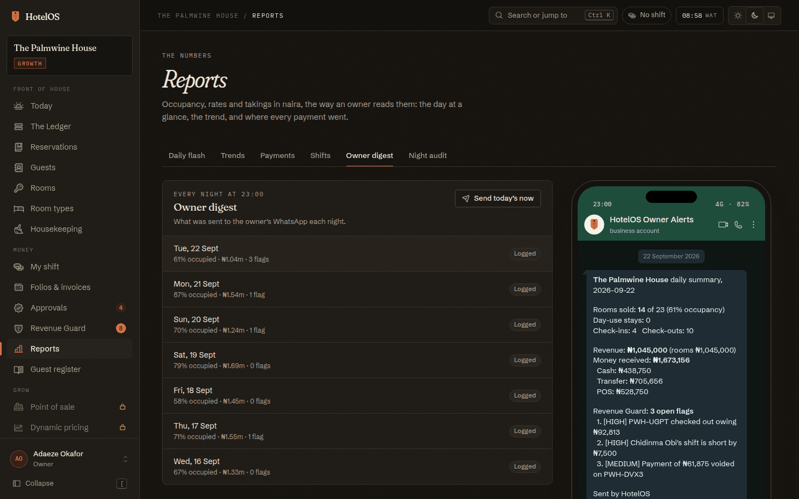 |
| 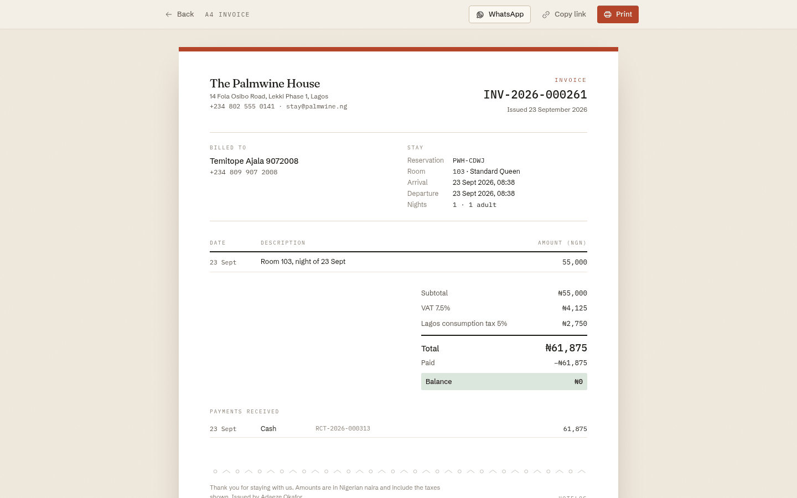 | 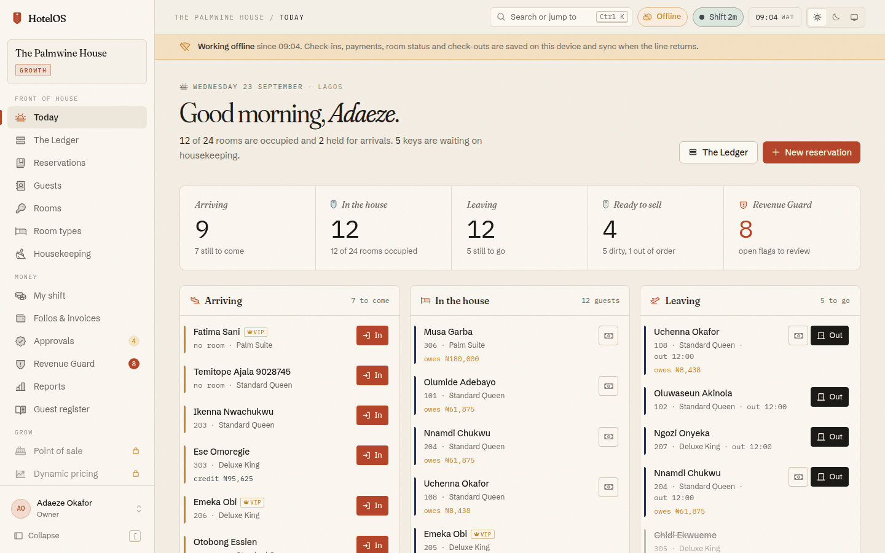 |

On a phone: [Today](docs/screenshots/m2-today-390-light.png), [the Ledger](docs/screenshots/m2-ledger-390-dark.png),
[register card](docs/screenshots/m2-check-in-390-dark.png), [blind count](docs/screenshots/m2-shift-blind-count-390-light.png),
[80mm receipt](docs/screenshots/m2-receipt-80mm-390-light.png). Every M2 page is in `docs/screenshots/m2-*`.

### M2 routes

| Route | |
|---|---|
| `/today` | Arriving, in the house and leaving with the next action on each card (check in, take payment, check out), a day-use rail with overstays, open flags and the cashier's shift |
| `/ledger` | **The Ledger** (tape chart): rooms by floor or type, 60 Lagos days, a today line and a rooms-free strip. Drag to move or extend, drag across empty nights to book, undo with Ctrl/Cmd+Z; `M` and the arrow keys (or the move panel on touch) do the same without a mouse |
| `/reservations`, `/reservations/[id]` | Views by status, dates, stay type and source; the reservation with its folio, stay, guest and register |
| `/reservations/[id]/check-in` | The **register card**: guest, ID capture (camera on phones via `capture`, or upload, downscaled first), travel, purpose and consent; clean-room assignment with a manager override; optional deposit. `?register=1` completes the register for a guest already in |
| `/guests`, `/guests/[id]` | Profiles with masked ID (reveal is audited), stays, edit, and NDPA **export** (JSON) and **anonymise** (typed confirmation) |
| `/register` | The police / security guest register for a date range; CSV download (full ID numbers for managers, audited) and print |
| `/shifts` | Open a shift with a float; close with a **blind count** (naira notes ₦1000 to ₦50, POS and transfer totals), then the variance is revealed |
| `/approvals` | Managers approve closed shifts after reading the count, payments and the cashier's note |
| `/folios`, `/folios/[id]` | Open and closed folios, walk-in folios, invoices and receipts |
| `/guard` | **Revenue Guard** inbox: severity, evidence, suggestion, resolve or dismiss with a note; locked rules shown with the upgrade path on Starter |
| `/reports` | Daily flash, trends (occupancy, ADR, payments by method in custom SVG), payments by method and staff, shifts, night audit runs, and the **owner digest** rendered on a phone |
| `/settings/taxes` | VAT, consumption tax and service charge (inclusive or on top) with a worked example; discount approval threshold |
| `/print/invoice/[id]`, `/print/receipt/[id]` | A4 invoice and 80mm thermal receipt with print CSS; WhatsApp share and copy link |
| `/share/[token]` | The public, signed page a guest opens from WhatsApp |

Anywhere: the **new-reservation drawer** (live availability per type and night, returning-guest lookup
by phone, optional room), the **take-payment sheet** (cash, transfer, POS; privileged methods for
managers; opens a shift inline if needed; receipt, print and WhatsApp), and the **discount dialog**
whose second key is a manager choosing their name and entering their PIN on the same screen. Managers
set that PIN from the account menu. The palette finds bookings by code or name ("check in PWH-7K3Q",
"pay Okafor") and adds *New reservation*, *Take payment* and *Close my shift*.

### Roles

The UI follows the M2 role matrix (`src/lib/permissions.ts`); the API enforces it regardless. Front desk
has no approvals, Revenue Guard, reports, voids, refunds or overrides; accountants read folios, shifts,
flags and reports; housekeeping sees rooms and can only turn a dirty room clean.

### Offline front desk

- `public/sw.js` keeps the app shell, static assets and page payloads (production builds only).
- Last-known Today, rooms, the tape chart, the current shift and open folios persist in IndexedDB and are
  restored on start, so a reload with no line still shows the house.
- **Check-in, payment, room status and check-out** go through `deskAction()`: each action gets its own
  `Idempotency-Key` and `clientCreatedAt` when the button is pressed. Offline (or if the request dies on
  the network) it is queued in an IndexedDB outbox with the same key and replayed in order on
  reconnect, so a request that did reach the server is never applied twice.
- An ochre banner shows while offline, a chip counts queued actions, and the sync sheet lists them with
  any conflicts (for example `SHIFT_REQUIRED`: open a shift, then retry) and lets you retry or discard.
- To try it without pulling a cable: `window.__offline(true)` in the console, and `false` to reconnect.

### End-to-end tests

```bash
pnpm test:e2e      # Playwright, Chromium from /opt/pw-browsers (or PW_CHROMIUM_PATH)
```

Runs against the dev server on :3001 and the live API on :4000 with the demo seed: sign in, book a
walk-in, check in on the register card with an ID image, take a cash payment inside a shift, check
out and get the final invoice, close the shift with a blind count, and find the variance in Revenue
Guard. Override with `E2E_BASE_URL`, `E2E_API_URL`, `E2E_EMAIL`, `E2E_PASSWORD`. A run writes real
bookings, payments and a shift to the demo hotel.

Development only: `localStorage["admin.apiOrigin"] = "http://localhost:4020"` points the app at another
API (such as a contract mock) without a restart; production builds ignore it.

## Milestone 3: the guest side, as the hotel sees it

Guests now book and pay online, on the marketplace and on each hotel's own booking site. The admin shows
where every booking came from, what was paid, what the platform kept, and what the guest was told.

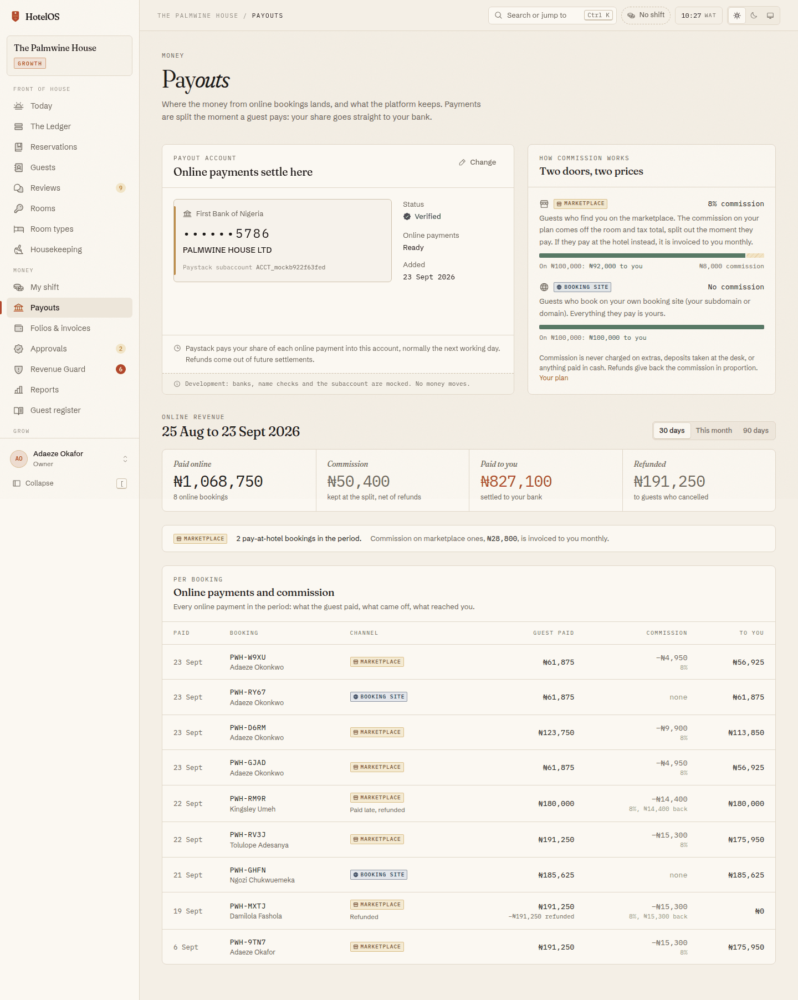

| | |
|---|---|
| 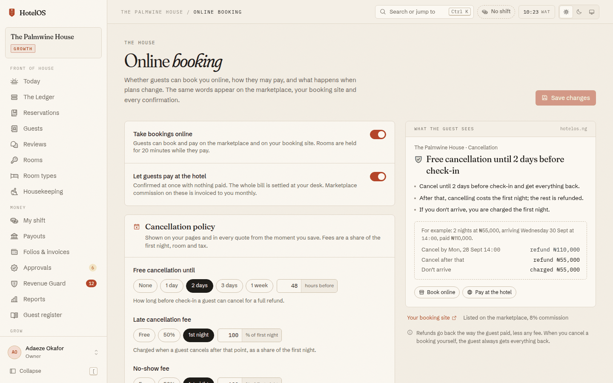 | 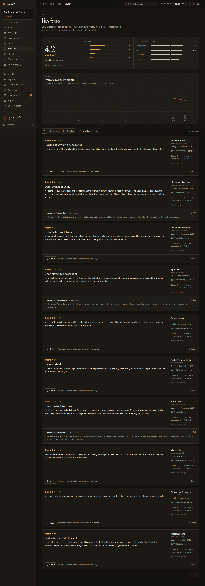 |
| 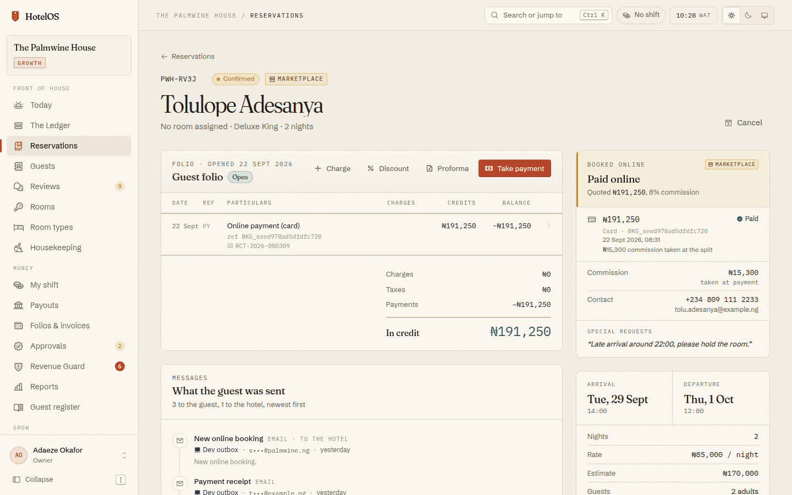 | 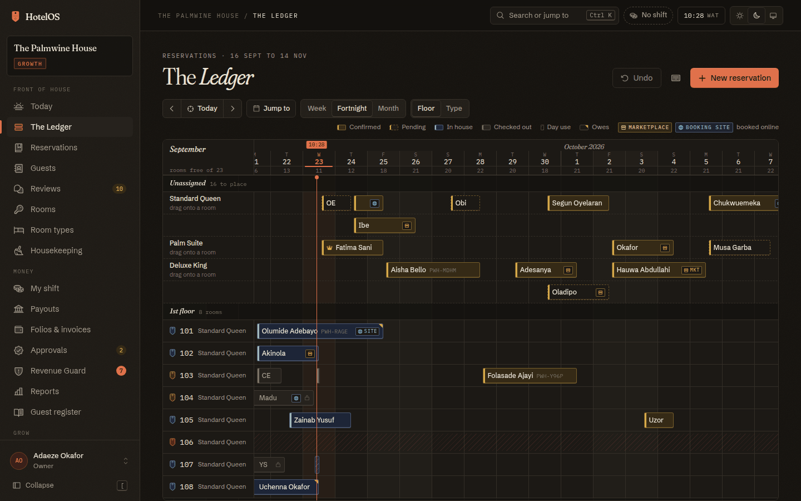 |
| 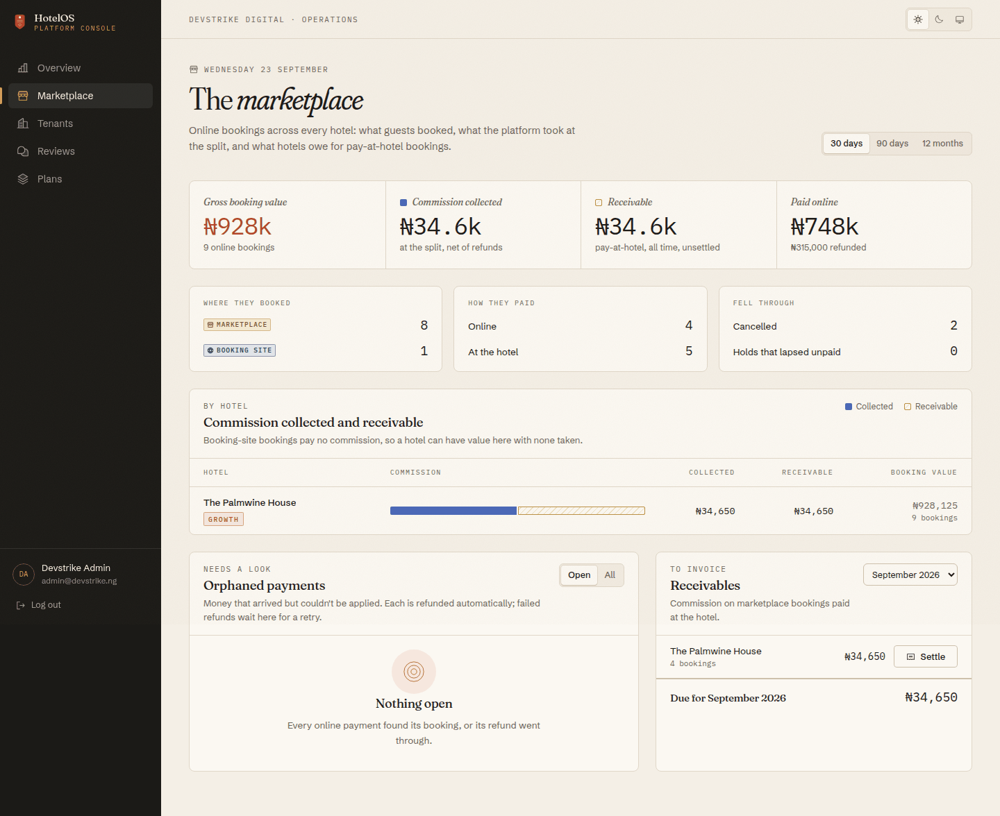 | 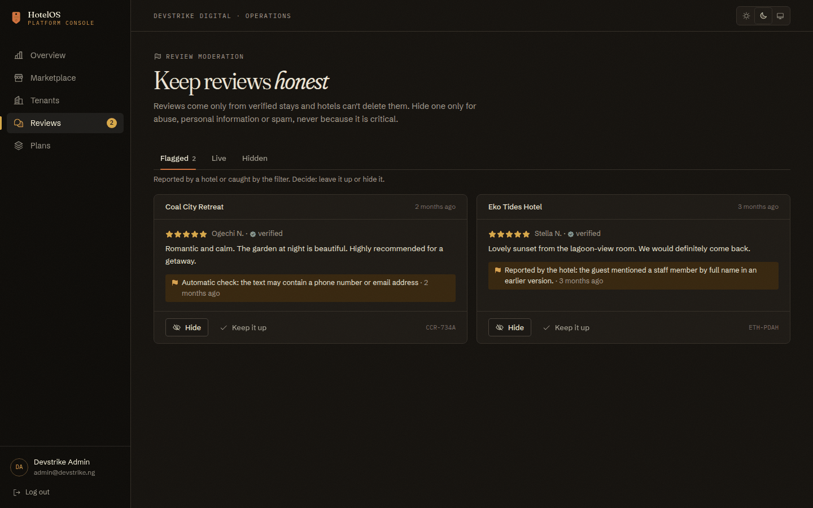 |
| 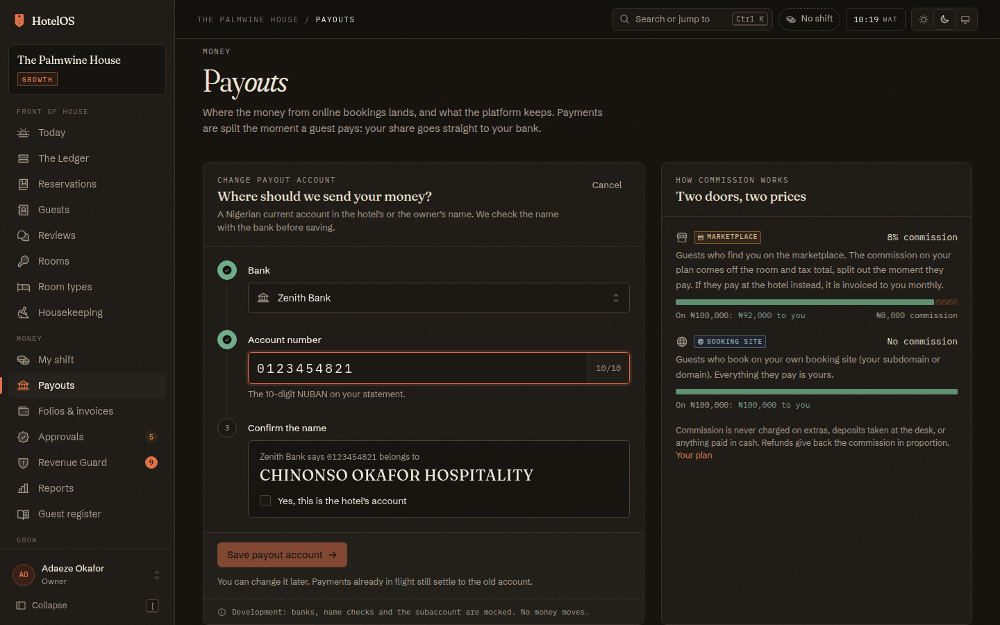 | 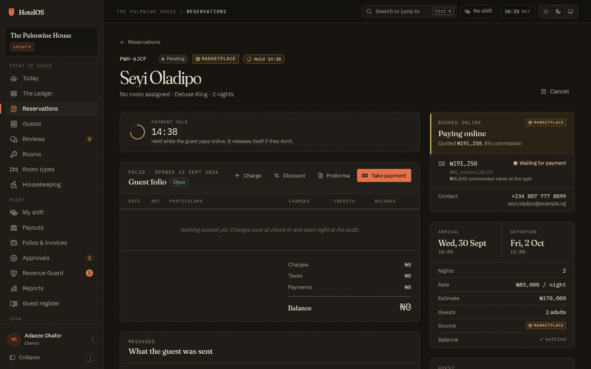 |
| 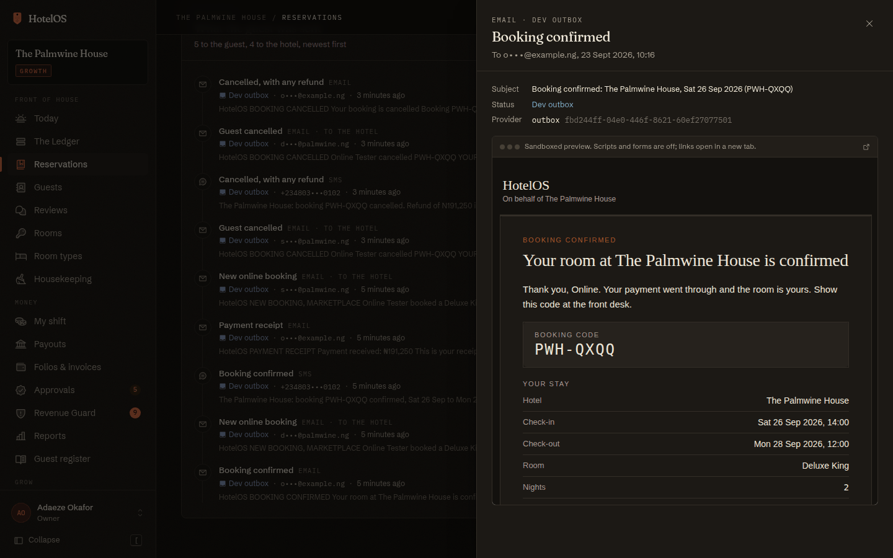 | 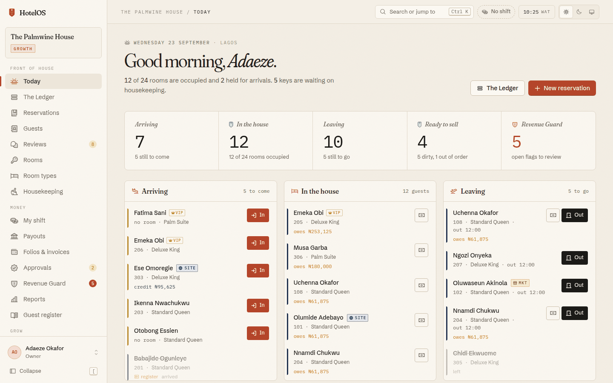 |

On a phone: [Payouts](docs/screenshots/m3-payouts-390-light.png), [Online booking](docs/screenshots/m3-booking-settings-390-dark.png),
[Reviews](docs/screenshots/m3-reviews-390-light.png), [bank look-up](docs/screenshots/m3-payouts-onboarding-390-light.png),
[email preview](docs/screenshots/m3-email-preview-390-light.png). Every M3 page is in `docs/screenshots/m3-*`.

### M3 routes

| Route | |
|---|---|
| `/payouts` | **Owner**: search Nigerian banks, type the 10-digit NUBAN, see the name the bank returns and confirm it before the Paystack subaccount is saved. Everyone with access: the account on file and its settlement status, paid online, commission, paid to you and refunds for 30 or 90 days, and commission per booking. The two channels are explained side by side: marketplace bookings pay the plan's commission (taken at the split, or invoiced monthly when the guest pays at the hotel); booking-site bookings pay none |
| `/settings/booking` | Online booking on or off, pay at the hotel, the cancellation policy (free window, late fee, no-show fee as presets or exact values) on a timeline, and **what the guest sees**: the same sentences plus a worked example with real dates and naira. The note added to the pre-arrival message |
| `/reviews` | Overall rating, the star spread (click to filter), subscores as rulers, a 12-month trend in hand-drawn SVG, filters by reply and traveller type, a reply composer with gentle checks (thank them, answer the point, no phone or room numbers), report to moderators, and a **Verified stay** link to the reservation |
| `/platform/marketplace` | Gross booking value, commission collected against receivable by hotel, the channel and payment mix, pay-at-hotel receivables by month with *Settle*, and orphaned payments with a refund retry |
| `/platform/reviews` | The moderation queue: flagged, live and hidden reviews; hide with a reason (abuse, personal details, off topic, spam, other) and a note the hotel sees, keep a flagged one up, or restore |

Online bookings everywhere else:

- **Channel stamps**: *Marketplace* (brass, a shop front) and *Booking site* (adire, a globe) on the Ledger bars and
  their hover cards, the reservations list (with a source filter), the reservation, the quick peek and the Today board.
  Colour never carries it alone: glyph and name (or `MKT` / `SITE` where space is tight) go with it.
- **Holds**: an unpaid online booking holds its room for 20 minutes. A countdown shows on the list, the board, the
  Ledger hover card and the reservation (a ring that turns ochre in the last five minutes). While it runs the desk
  cannot confirm or check it in by hand.
- **The reservation** gains a *Booked online* card (paid online or at the hotel, each Paystack payment and its
  reference, commission, refunds, contact, special requests) and **What the guest was sent**: a timeline of every
  email, SMS and WhatsApp with status and provider. Opening one shows the SMS as a phone bubble (with its length) or
  the email in a sandboxed iframe (no scripts, no same-origin, a strict CSP inside the document).
- **Cancelling a booking paid online** from the admin always refunds the guest in full, whatever the policy; the
  dialog shows the refund and the commission given back, and needs an owner or manager.
- **New online booking slips**: the shell polls `GET /online-bookings/feed?since=` every 30 seconds and drops a slip
  for each new booking, payment or cancellation (the first poll only sets the baseline), and refreshes the desk views.
  Today has a *Booked online* card with arrivals, new bookings and open holds.
- The palette adds *Marketplace bookings*, *Booking site bookings*, *Reply to reviews*, *Change cancellation policy*,
  *Turn online booking on or off* and *Set up or change the payout account*; the sidebar adds Reviews (with the
  number waiting for a reply), Payouts and Online booking, and the console adds Marketplace and Reviews (with the
  flagged count) and a marketplace strip on its overview.

### M3 roles

| | Owner | Manager | Front desk | Accountant |
|---|---|---|---|---|
| Payouts | read, set up the account | read | | read |
| Online booking settings | edit | edit | | |
| Reviews | read, reply, report | read, reply, report | read | read |
| Message bodies (email preview) | yes | yes | yes | first lines only |
| Cancel a booking paid online | yes | yes | | |
| New booking slips | yes | yes | yes | yes |

Shots were taken against the live API and its M3 seed; the payout account look-up and Paystack are in dev mock mode.

### M3 end-to-end tests

`e2e/online.spec.ts` runs with the rest (`pnpm test:e2e`): an owner without a payout account (Wuse Garden in the seed)
sets one up in dev mock mode (bank search, account look-up, confirm the name, save), a manager replies to a review,
an owner changes the cancellation policy and sees the guest's wording change before saving (then restores the seed
default), and a marketplace booking is found by its channel badge and opened. `E2E_API_ORIGIN` points the app at
another API origin through the development override.

## Milestone 4: the house at work, and what a night is worth

Housekeeping, maintenance, roles you can shape yourself, and the commercial side: seasons and prices on one
almanac, rate plans, promo codes, company accounts and the City Ledger that bills them.

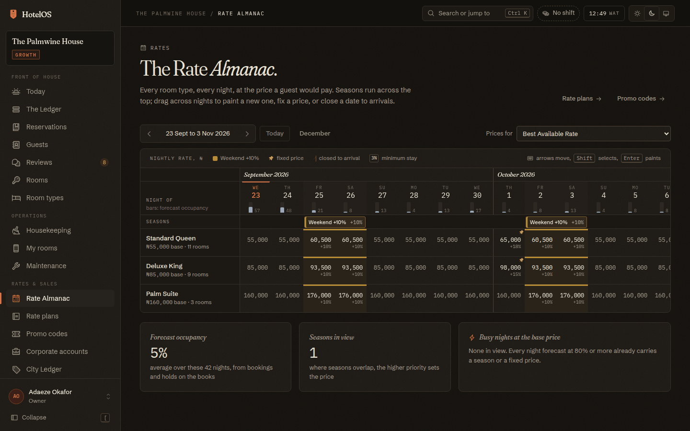

| | |
|---|---|
| 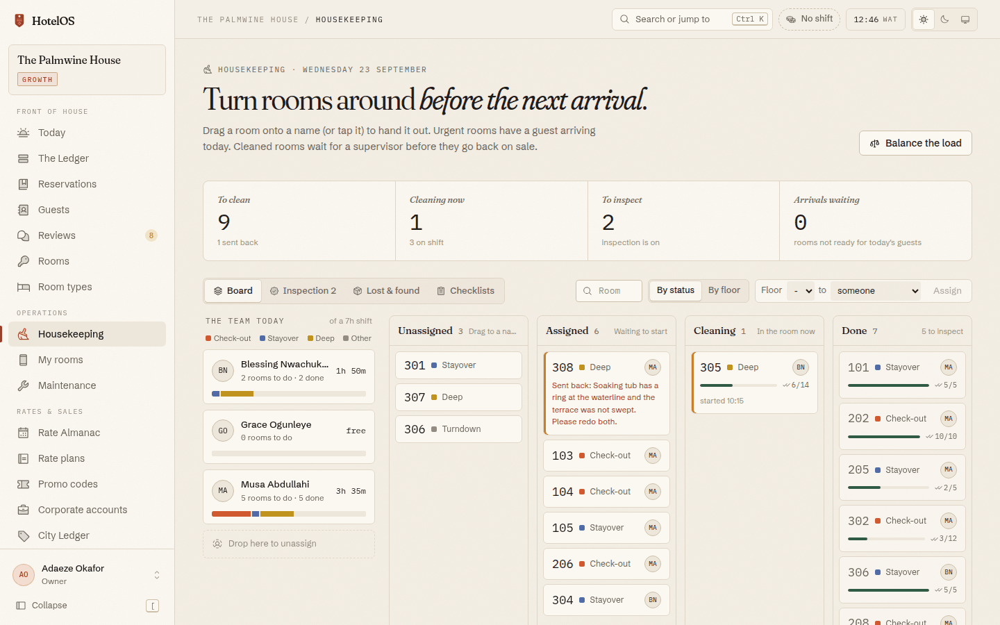 | 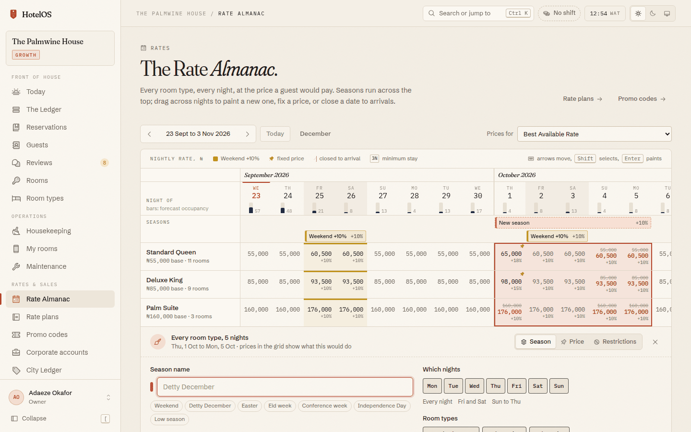 |
| 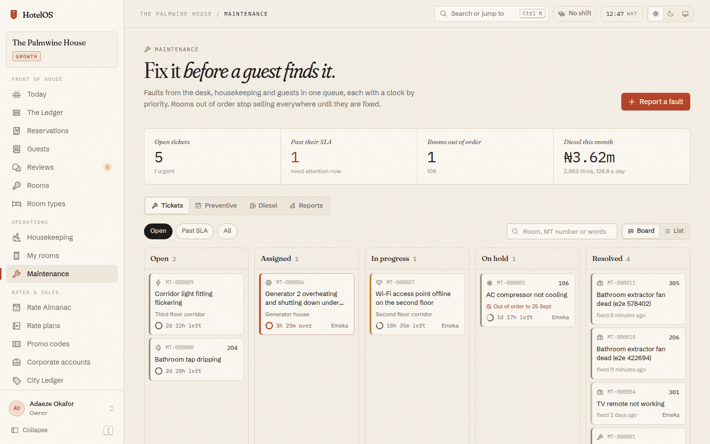 | 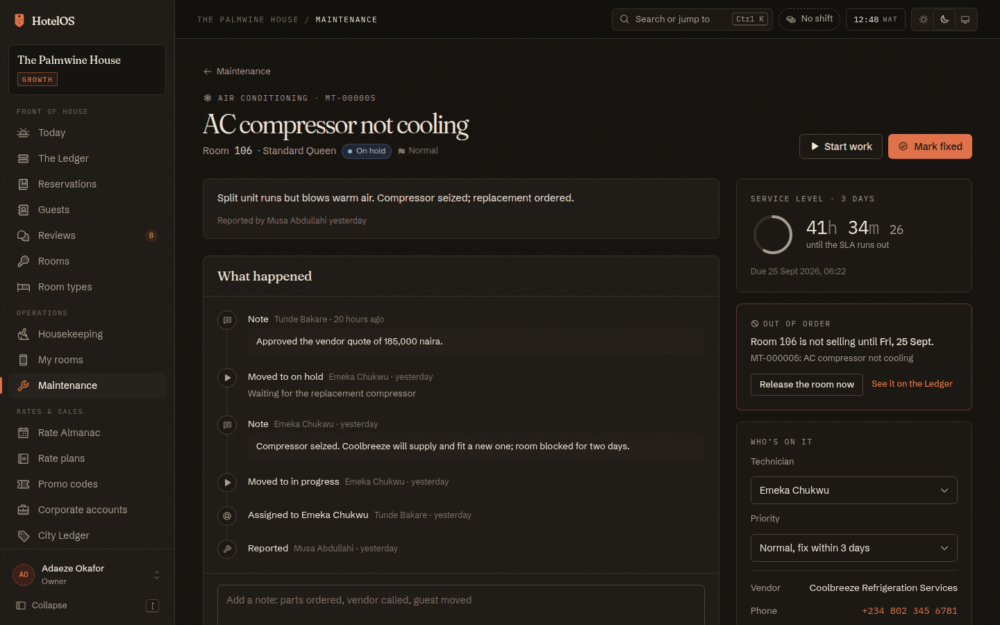 |
| 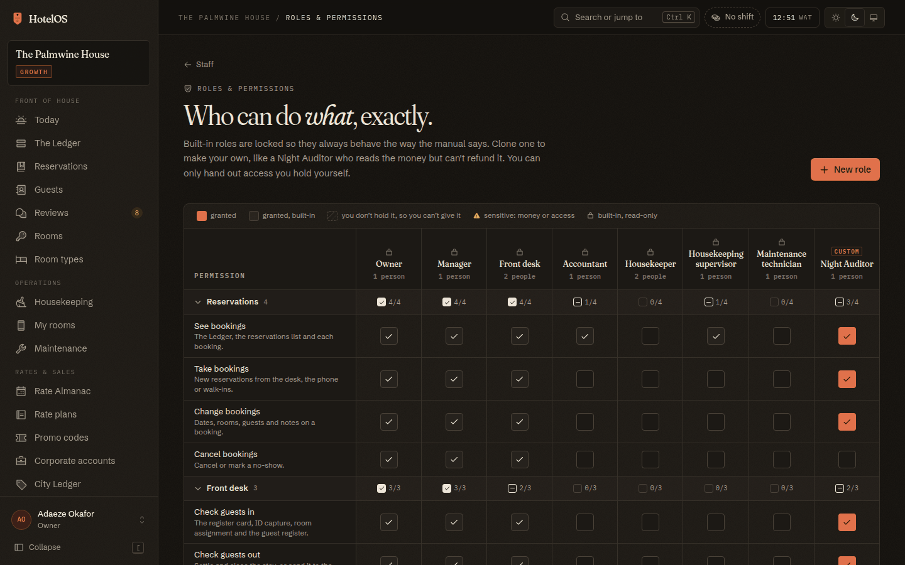 | 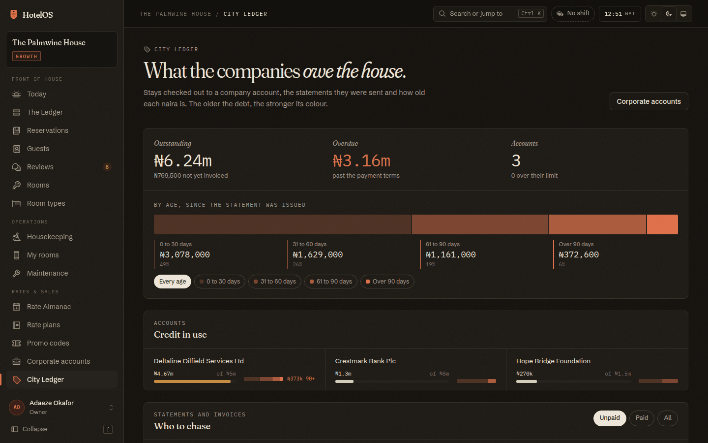 |
| 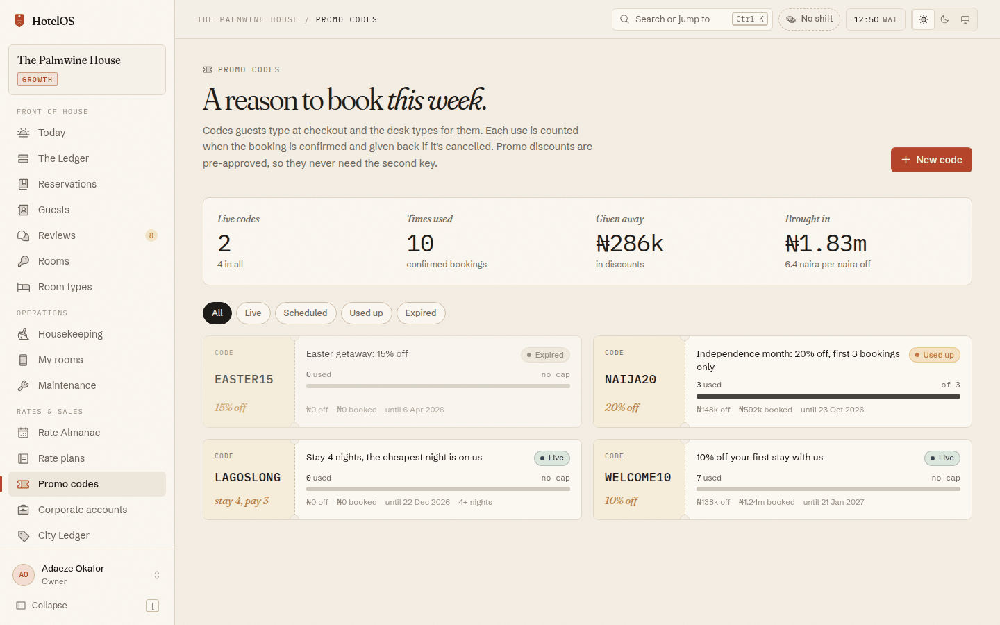 | 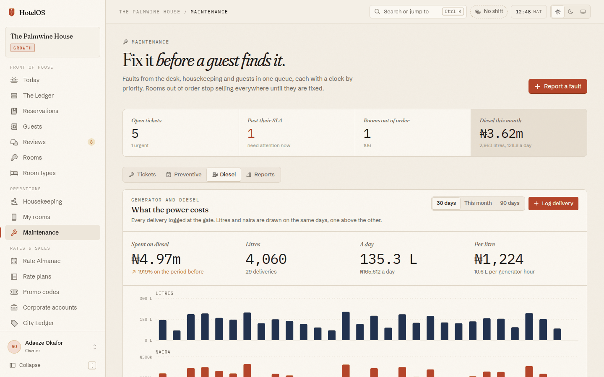 |
| 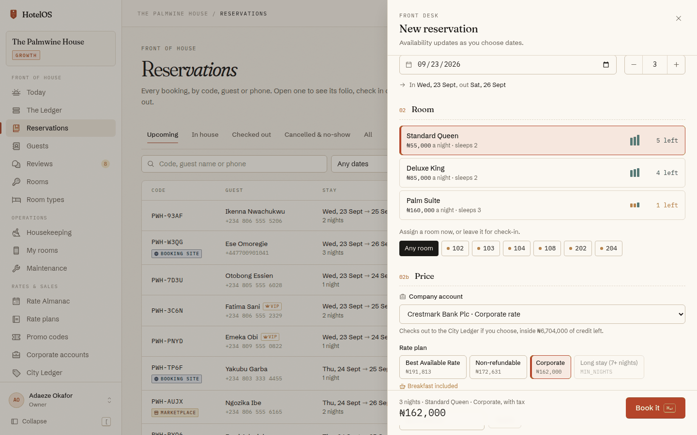 | 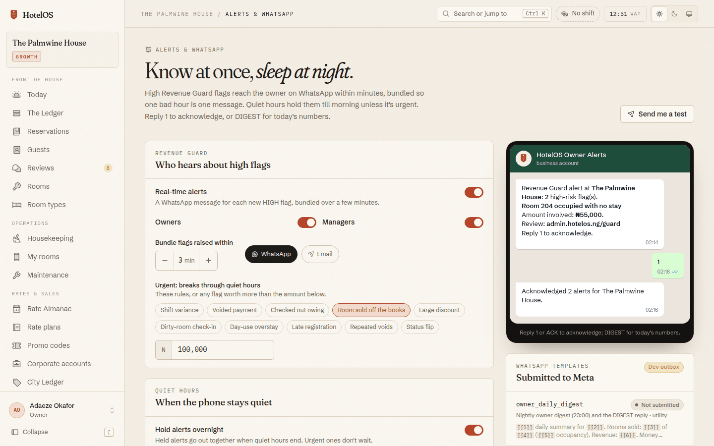 |

On a phone: [My rooms (`/hk`)](docs/screenshots/m4-hk-390-dark.png), [offline](docs/screenshots/m4-hk-offline-390-dark.png),
[housekeeping](docs/screenshots/m4-housekeeping-390-light.png), [maintenance](docs/screenshots/m4-maintenance-390-dark.png),
[almanac](docs/screenshots/m4-rates-390-light.png), [roles](docs/screenshots/m4-roles-390-light.png). On a lower plan the
same pages show an upgrade preview built from the real components ([rates](docs/screenshots/m4-upsell-rates-1440-light.png)).
Every M4 shot is in `docs/screenshots/m4-*`.

### M4 routes

| Route | |
|---|---|
| `/housekeeping` | **Board**: Unassigned, Assigned, Cleaning, Done. Drag a room onto a person (or tap it, then tap a name), assign a whole floor, or *Balance the load* from the server's suggestion (shown as ghost chips before you apply). Each person's workload bar is minutes against a 7-hour shift, split by clean type. Arrivals today are marked urgent. **Inspection**: pass, or send back with a reason. **Lost & found**: log, hand back, dispose. **Checklists**: per clean type, with inspection, stayover and deep-clean rules |
| `/hk` | The housekeeper's phone view: today's rooms, one room at a time, a large checklist and *Finish room*. Works with no signal: starts, ticks, finishes and skips go through the offline outbox (Idempotency-Keys) and send when the line is back. Housekeepers land here after sign-in |
| `/maintenance` | Tickets as a board (drag to change status) or a list, filters for open and past SLA, *Report a fault* with room or area, category, priority and **block the room**: if reservations clash, the dialog lists them before you block anyway. Tabs for the **preventive** calendar and schedules, the **diesel log** (litres and naira as two aligned charts, never a dual axis) and reports |
| `/maintenance/[id]` | Timeline, a live SLA countdown, assignee and priority, the out-of-order card with *See it on the Ledger* (`/ledger?room=`, where the block shows as a hatched band) and release |
| `/rates` | **The Rate Almanac**: room types by nights with the resolved price a guest would pay, season bands across the top, fixed-price pins, minimum-stay and closed-to-arrival marks, forecast-occupancy bars per night. Drag (or Shift+arrows, then Enter) to paint a season, a fixed price or restrictions. Fully keyboard operable (`role="grid"`) |
| `/rates/plans` | Rate plans: price rule against the best available rate, cancellation, stay length, channels |
| `/promotions` | Promo codes with times used, given away and revenue brought in |
| `/corporate` | Company accounts: negotiated plan, credit limit, terms, credit in use, aging, stays |
| `/city-ledger` | Outstanding and overdue, aging buckets, credit per account, statements with *Record payment*, *Send reminder* and a print view (`/print/statement/[id]`) |
| `/staff/roles` | The permission matrix: built-in roles locked (clone one to change it), custom roles editable, cells you can't grant hatched (no escalation), and a *What changes* diff before saving |
| `/settings/notifications` | Revenue Guard alerts (who, bundling, urgent rules, quiet hours on a day ruler), WhatsApp template approval status and the alert log |
| `/audit` | Adds *Export* (CSV or JSON by date range), on Pro |

The new-reservation drawer gains rate plan, company account and promo code pickers with a per-night price breakdown
from `POST /rates/quote`; check-out can charge a company account to the City Ledger (within its credit limit).

### Permissions

The UI no longer gates by role name. `/me` returns `permissions`, and `useCan()` (`src/lib/permissions.ts`) checks
them for pages, sidebar items, palette entries and buttons. If a token predates M4, the built-in role map is the
fallback. A custom role is enforced the same way everywhere, so hiding a page from a role hides its nav item, its
palette entry and the page itself ("Rates isn't part of your role").

### M4 end-to-end tests

`e2e/m4.spec.ts`: a housekeeping task finished on `/hk` and passed at inspection leaves the room clean; a
maintenance ticket that blocks a room shows the block on the Ledger; a custom role without a page hides it from a
user who holds that role; painting a season on the almanac changes the price; a booking with a promo code and a
company account checks out to the City Ledger. The tests make their own data when the seed lacks it and clean up
after themselves.

---

## Stack

| | |
|---|---|
| Framework | Next.js 16 (App Router, Turbopack), React 19, TypeScript (strict) |
| Styling | Tailwind CSS v4, CSS-first `@theme` tokens, default palette removed |
| Type | Fraunces (display, `opsz`/`SOFT`/`WONK` axes), Schibsted Grotesk (UI), IBM Plex Mono (numbers) via `next/font/google` |
| Icons | `@phosphor-icons/react` (duotone in navigation) |
| Data | TanStack Query v5 and a small typed `fetch` client |
| Primitives | Radix Dialog / Dropdown / Tooltip and `cmdk`, fully restyled |

## Getting started

```bash
pnpm install
cp .env.example .env.local     # adjust if the API is not on :4000
pnpm dev                       # http://localhost:3001
```

The backend (`hotel-management-backend`) must be running at `NEXT_PUBLIC_API_URL`
(default `http://localhost:4000`, API prefix `/api/v1`) with CORS allowing `http://localhost:3001`.

Seed accounts:

| Who | Email | Password |
|---|---|---|
| Hotel owner, The Palmwine House (Growth, active) | `demo@palmwine.ng` | `Demo1234!` |
| Starter trial (housekeeping locked) | `owner@wusegarden.ng` | `Demo1234!` |
| Starter, past due | `owner@marinacreek.ng` | `Demo1234!` |
| Platform console | `admin@devstrike.ng` | `Admin1234!` |

In development the sign-in pages show a small "Dev" button that fills the demo credentials.

### Scripts

| | |
|---|---|
| `pnpm dev` | Dev server on port 3001 |
| `pnpm build` | Production build (includes the TypeScript check) |
| `pnpm start` | Serve the build on port 3001 |
| `pnpm lint` | ESLint (flat config, `eslint-config-next`) |
| `pnpm typecheck` | `tsc --noEmit` |
| `pnpm test:e2e` | Playwright end-to-end tests against the live API |

### Environment

| Variable | Example | Purpose |
|---|---|---|
| `NEXT_PUBLIC_API_URL` | `http://localhost:4000` | API origin; the client appends `/api/v1` |
| `NEXT_PUBLIC_APP_NAME` | `HotelOS` | Product name (placeholder) |
| `NEXT_PUBLIC_APP_DOMAIN` | `hotelos.ng` | Product domain |
| `NEXT_PUBLIC_SUPPORT_EMAIL` | `support@hotelos.ng` | Support links, "Talk to us" |
| `NEXT_PUBLIC_WEB_URL` | `http://localhost:3000` | Customer site, for "View booking page" links |

## What's in it

**Hotel admin**

| Route | |
|---|---|
| `/login`, `/signup` | Split layout with an animated adire panel; three-step onboarding ending on the 14-day Growth trial |
| `/today` | Greeting in Lagos time, headline ledger, **Key Rack**, occupancy dial, plan usage, activity, housekeeping queue |
| `/rooms` | Key rack or table view, floor/type/status filters, add, bulk add a range (with preview), edit, delete |
| `/rooms/types` | Room types with naira nightly rates; the hourly rate is locked without `hourly_bookings` |
| `/staff` | Staff with roles, seat usage, add / edit / remove |
| `/property` | Details, check-in/out with a turnaround ruler, amenities, house rules, marketplace toggle, branding (gated) |
| `/billing` | Current plan, usage, four-tier comparison with monthly/yearly savings, checkout, invoices |
| `/billing/mock-checkout` | Development stand-in for Paystack; calls `POST /billing/dev/confirm` |
| `/audit` | Day-grouped timeline, paging, CSV export (gated by `audit_export`) |
| `/housekeeping` | Live board on Growth and above; preview and upgrade card below it |
| `/pos`, `/channel-manager`, `/dynamic-pricing`, `/loyalty` | Locked previews naming the plan that unlocks them |

Cmd/Ctrl+K opens the command palette: navigation, actions ("Add rooms in bulk", "Add staff member"),
theme and log out. Type a room number and a status (`204 dirty`, `305 clean`) to change it without
leaving the keyboard. `[` collapses the sidebar.

**Platform console** (`/platform`, separate sign-in and token)

| Route | |
|---|---|
| `/platform` | MRR and ARR, weekly signups, plan mix, subscription health, trials ending soon |
| `/platform/tenants` | Search, plan and status filters, paging |
| `/platform/tenants/[id]` | Change plan and status, extend the trial (+7 / +14 days), grant or remove add-on features |
| `/platform/plans` | Name, tagline, prices (or custom), limits (or unlimited), commission, highlight, features |

## Architecture

```
src/
  app/
    (auth)/login, signup           public sign-in and onboarding
    (hotel)/...                    staff app, wrapped by AppShell (route protection)
    (checkout)/billing/mock-checkout
    platform/login                 console sign-in
    platform/(console)/...         console, wrapped by PlatformShell
  components/
    keyrack/                       Key Rack, status textures, status sheet
    shell/                         sidebar, top bar, palette, theme, trial pill, Lagos clock
    gating/                        <Gate>, upgrade dialog, locked feature pages and previews
    charts/                        hand-built SVG charts (occupancy dial, columns, share bar, unit rows)
    motifs/                        adire line motifs
    ui/                            restyled primitives
    dashboard, rooms, staff, property, billing, audit, platform, auth
  lib/
    api/client.ts                  fetch wrapper, error envelope, refresh single-flight
    api/session.ts                 hotel + platform token storage (localStorage, guarded)
    api/endpoints.ts, hooks.ts     typed endpoints and TanStack Query hooks
    api/mutations.ts               optimistic room status
    api/types.ts                   the M1 contract as TypeScript
    catalog.ts                     statuses, roles, plans and feature fallbacks
    format.ts                      naira, Lagos dates, relative time
```

M2 adds:

```
src/
  app/(hotel)/ledger, reservations, guests, register, shifts, approvals, folios, guard, reports, settings/taxes
  app/(print)/print/invoice/[id], print/receipt/[id]     signed-in print views, no chrome
  app/share/[token]                                      public signed document page
  app/manifest.ts                                        PWA manifest
  components/
    ledger/          model.ts (rows, lanes, geometry, validation) and ledger.tsx (virtualised chart)
    reservations/    list, detail, new-reservation drawer, quick peek, check-out
    checkin/         register card, ID capture
    folio/           folio ledger, charge / void / discount (second key), take-payment sheet
    documents/       A4 invoice, 80mm receipt, share actions
    shifts/          denomination counter, blind count, variance, approvals
    guard/ reports/ guests/ settings/ offline/
  lib/
    api/types-m2.ts, endpoints-m2.ts, hooks-m2.ts   the M2 contract
    dates.ts                                        Lagos calendar arithmetic (UTC+1, no DST)
    permissions.ts                                  role capabilities
    offline/                                        IndexedDB, network state, outbox, desk actions, persistence
public/sw.js, public/icons/                         service worker and app icons
```

M3 adds:

```
src/
  app/(hotel)/payouts, reviews, settings/booking
  app/platform/(console)/marketplace, reviews
  components/
    m3/bits.tsx       channel badge, hold countdown, stars
    payouts/          bank picker (combobox), onboarding, account, commission explainer, payments
    reviews/          reviews page, SVG rating trend, subscore rulers, star spread
    online/           feed runtime (slips) and the Today card
    notifications/    message timeline, sandboxed email frame
    reservations/online-card.tsx
    gating/require-cap.tsx
  lib/
    api/types-m3.ts, endpoints-m3.ts, hooks-m3.ts    the M3 contract
    policy.ts                                        cancellation policy in plain language
e2e/                                                Playwright tests
```

The Ledger renders only the rows and bars in view (plus overscan), draws the day grid with a single
repeating gradient, and indexes stays by room, so 200 rooms by 60 days stays smooth. Payment-method
colours (`--m-*`) were checked with a colour-vision validator for adjacent separation in both themes;
every chart has a legend, direct values and a screen-reader table.

### Auth and sessions

- Hotel tokens `{ accessToken, refreshToken }` live in `localStorage` (`admin.session.hotel`, access
  guarded by try/catch), mirrored in memory and observed with `useSyncExternalStore`, so tabs stay in step.
- **Silent refresh**: the access token is refreshed a minute before its `exp`; any 401 also triggers a
  single-flight `POST /auth/refresh` and one retry. Refresh tokens rotate; a failed refresh (including
  `REFRESH_TOKEN_REUSED`) clears the session and sends the user to `/login?next=...&expired=1`.
- Platform tokens are stored separately (`admin.session.platform`) with their own guard.
- Route protection is client-side because the API is on another origin: shells show a splash until
  the session is known, then redirect when it is missing. The API enforces everything regardless.

### Feature gating

The UI mirrors the API's entitlements; it never replaces them.

- `GET /me` returns `entitlements.features`, `limits` and `usage`. `useEntitlements()` exposes
  `has(feature)`, `limit(code)` and `requiredPlan(feature)` (the cheapest plan that includes it,
  computed from `GET /public/plans`, with a static fallback).
- `<Gate feature="booking_site_branding" fallback={...}>` renders its children only when entitled;
  the default fallback is a compact "available on Growth" card with an upgrade button.
- Locked routes (`/pos`, `/channel-manager`, `/dynamic-pricing`, `/loyalty`, and `/housekeeping` on
  Starter) use `FeaturePage`: a quiet preview with sample data plus an upgrade card. The sidebar and
  the command palette mark them with a small brass lock.
- **Global error routing** in the TanStack `MutationCache`:
  - `FEATURE_LOCKED` (403) opens the upgrade dialog for `details.feature` / `details.requiredPlan`.
  - `LIMIT_REACHED` (403) opens it with the current cap and what the next plan allows.
  - `SUBSCRIPTION_READ_ONLY` (402) opens the read-only dialog and pins a banner across the app.
  - Anything else becomes an in-system toast; `VALIDATION_ERROR` field messages are surfaced.
- Subscription banners also follow `/me`: read-only or suspended (danger), past due (ochre), and a
  dismissible reminder when a trial has three days or fewer left.

### Billing flow

`Upgrade to X` calls `POST /billing/checkout { planCode, interval }` and redirects to
`authorizationUrl`. Without a Paystack key the API returns
`${ADMIN_URL}/billing/mock-checkout?reference=...`; that page shows the plan and amount (kept in
`sessionStorage` across the redirect) and calls `POST /billing/dev/confirm { reference }`.
Enterprise is "Talk to us" (mailto), since the API rejects checkout for plans without a price.

## Design system: Laterite & Adire

A Lagos boutique hotel's printed stationery meets a precise Swiss ledger.

- **Tokens** are CSS variables on `:root` and `[data-theme="dark"]` in `src/app/globals.css`, exposed
  to Tailwind through `@theme inline` (`bg-paper`, `text-ink`, `border-line`, `bg-laterite` ...).
  `--color-*: initial` removes Tailwind's default palette so only house colours exist.
- **Colour**: paper and surface neutrals; laterite for primary actions; brass for highlights and plan
  plates; palm, adire (indigo), ochre and danger carry room status. Plan identity colours for charts
  (`--plan-*`) were checked for colour-blind separation in their adjacent order.
- **Type**: Fraunces for headings, with an italic "soft, wonky" accent word; Schibsted Grotesk for UI;
  IBM Plex Mono with tabular, slashed-zero figures for every number, amount and room number.
- **Shape**: 2 to 8px radii (pills only for status chips), hairlines instead of shadows, soft shadows
  only on floating layers, a faint paper grain behind everything.
- **Motifs**: adire eleko squares (rings, dotted grids, river zigzags, crossed squares, palm fronds)
  drawn as 1px lines, used on the sign-in cloth, dialog panels, empty states and dividers.
- **Motion**: 150 to 250ms ease-out; key tags swing on hover and when their status changes; the sign-in
  pattern draws itself in and drifts slowly. `prefers-reduced-motion` switches all of it off.
- **Theme**: light, dark or system, applied before first paint by an inline script, persisted in
  `localStorage`, switchable from the top bar, the account menu or the palette.

### The Key Rack

Each room is a key fob hanging from a brass rail, one rail per floor, like the board behind a
classic front desk. The fob shows the room number in mono and a band with a three-letter code.
Status never depends on colour alone: colour (palm, adire, ochre, brass, danger), texture (plain,
adire diagonal, specks, inset ribbon, cross-hatch) and a code (`CLN`, `OCC`, `DRT`, `RSV`, `OOO`).
It is a roving-tabindex grid: arrow keys move between keys and floors, Home/End jump, Enter opens the
status sheet, and 1 to 5 pick a status inside it. Changes are optimistic: the fob flips and swings
at once and rolls back if the API refuses.

### Accessibility

Semantic landmarks and a skip link, 2px laterite focus rings, labelled icon buttons, radio groups for
segmented controls, `role="meter"` for usage, live-region toasts, a screen-reader table behind each
chart, AA contrast in both themes, and 16px inputs on phones to avoid zoom on focus.

## Notes

- `docs/screenshots` was captured with Playwright against the live API at 1440px and 390px.
- The room table and the console tables scroll horizontally on phones; the Key Rack, staff list and
  the rest reflow.
